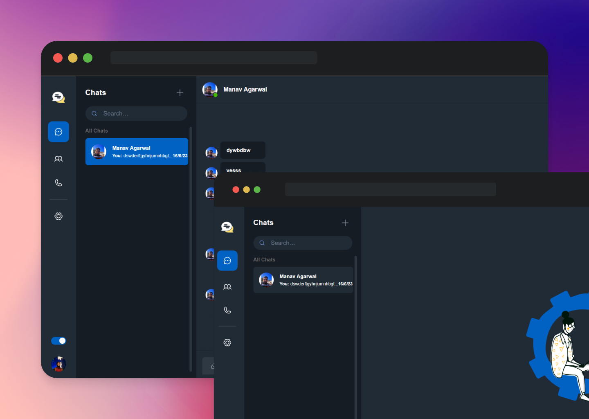

<div align="center">
  
  <h1>Welcome to Babble 👋</h1>
  <a href="https://babble-taupe.vercel.app/"><b>babble-taupe.vercel.app »</b></a><br><br>  
</div>

## About Babble
Babble is a real-time messaging application that allows users to communicate with each other via chat rooms. It is built using Node.js, React, Socket.IO, and MongoDB, providing a seamless and interactive chat experience.
<br><br>
<div align="center">
    
</div>

## Features
- **Real-time Messaging:** Enjoy instant communication with other users in real-time using Socket.IO, making conversations smooth and engaging.
- **User Authentication:** Users can register and log in securely to access the chat application and its features.
- **Single/ Group Chats:** Users can interact with each other in single one-one chats OR in Group chats.
- **Chat Room Creation and Management:** Users can create new chat rooms or join existing ones based on their interests or topics.
- **Text and Emoji Support:** Send text messages and spice up conversations with a wide range of emojis.

## Technologies Used
The Chat App is built using the following technologies and libraries:
- **Node.js:** For the server-side environment and backend development.
- **React:** For building the user interface and providing an interactive front-end experience.
- **Socket.IO:** For enabling real-time bidirectional communication between the client and server.
- **MongoDB:** As the database for storing chat messages and user information.
- **Express.js:** For handling routes and requests (if applicable).
- **Redux:** For managing global states in the client app.

## Usage
Once the Chat App is set up, you can just open your web browser and navigate to the application. You will be prompted to log in or register if you don't have an account. After logging in, you can:
- Create new chat rooms or join existing ones.
- Send messages to other users in real time.
- Use emojis to express emotions in your conversations.
- Share files and documents with other users.
- Access previous chat history even after closing the application.
  
## TODO
- [ ] Implement Functionality to Upload Files ([#1](https://github.com/Hadeso-0/Babble/issues/1))
- [ ] Add Functionality to make calls/ Video Calls ([#5](https://github.com/Hadeso-0/Babble/issues/5))
- [ ] Make the Chats end-to-end Encrypted ([#6](https://github.com/Hadeso-0/Babble/issues/6))

## Setup on your Device
```
git clone https://github.com/Hadeso-0/Babble
npm install
npm start
cd server 
npm install
npm start
```
Open [http://localhost:3001](http://localhost:3001) with your browser to see the result.
